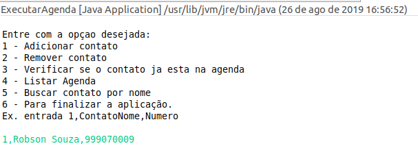
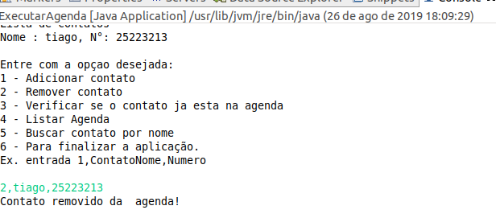
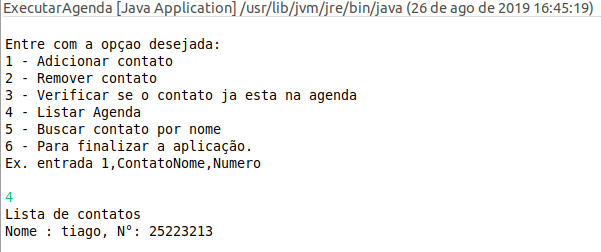
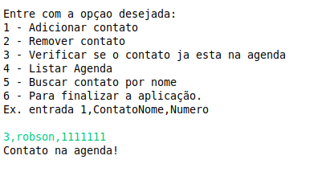
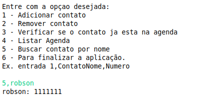
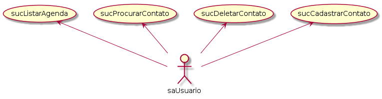
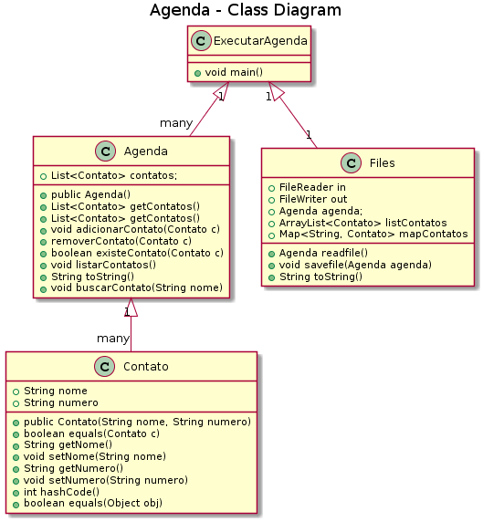
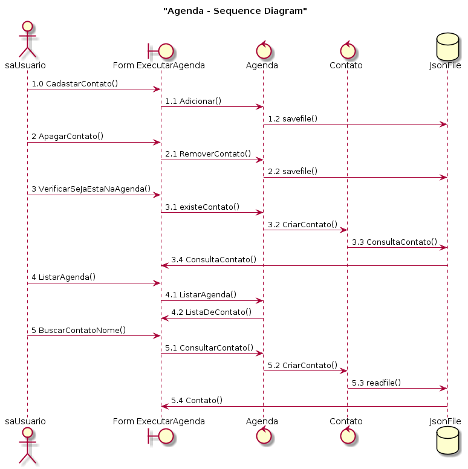

# Read Me
# Read Me

Projeto Agenda
Projeto agenda tem como funçao implementar uma agenda telefonica com operacoes de inserir, remover,listar contatos, buscar contato e  verificar se ja foi se encontra na agenda sem retorno do contato.

Projeto composto por 4 classes a classe principal sendo ExecutarAgenda resposavel por rodar todo o projeto. Classe Files responsavel pela leitura e gravação dos dados em um arquivo JSon e as outras duas classes Contato e Agenda responsavel pela manipulação dos objetos.

| Funcionalidade| Descrição |
| ------ | ------ |
| Adicionar | Adiciona um contato com nome e numero|
|Remover| remove um contato com nome e numero |
| Existente  na Agenda | verifica se o nome e numero ja se encontra na agendan no mesmo contato |
| Listar Agenda | Traz todos os contatos listado na agenda |
| Buscar por nome | Busca na agenda o contato com o nome informado. |
# Formato de entrada

Todos os comandados sao recebidos nas mesma linha separados por virgula como no exemplo abaixo:
EX. 1,Nome Contato,NumeroContato

# Rodar projeto

Projeto e Roda a partir do arquivo Jar no Terminal.

Rodar no windows:

$ cd /dieretorioDoJar
$ md files
$ cd /files
$ copy con Agenda.json
$ cd ../
$ java -jar Agenda.Jar

Rodar no Linux:

$ cd /dieretorioDoJar
$ mkdir files
$ cd /files
cat > Agenda.json
$ cd ../
$ java -jar Agenda.Jar

OBS. O formato das entradas do programa no terminal deve ser feitas da seguinte forma:
    **1,NomeContato, NumeroContato**
Onde o numeral e o comando a ser executado, segundo campo apos a primeira virgula e o nome do contato e terceiro campo o numero de contato.

#PrintScreen da tela.

Adicionar Contato

Remover contato

Listar Contatos
 

Verificar se existe na agenda
 

Buscar Por Nome
 

# Documentação:
 Diagrama de Caso de uso
 

 Diagrama de Classe
 

 Diagrama de Sequencia
 

# Tecnologias:

Projeto desenvolvido na IDE Eclipse.
Biblioteca Gson da Google.
